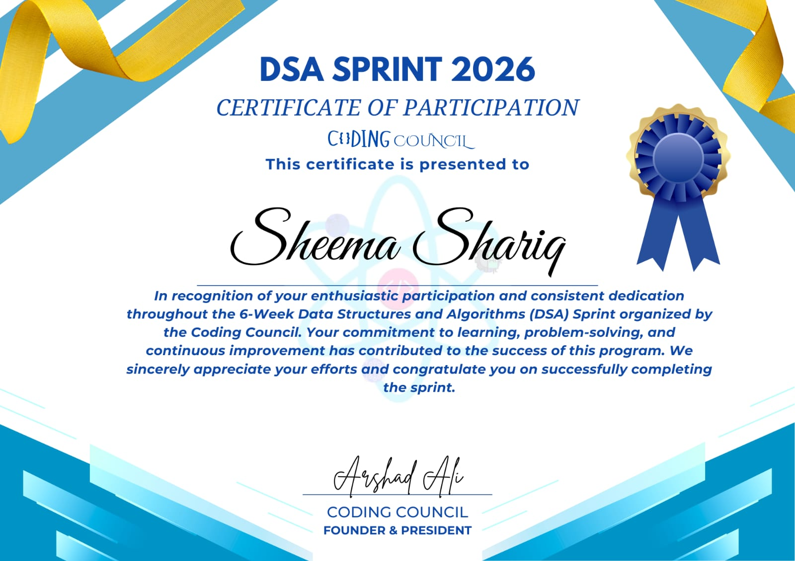

# DSA Practice 🚀
A structured repository for my complete DSA journey —
college coursework and Striver's A2Z sheet combined.

## 👨‍💻 About Me
CS Undergraduate @ Jamia Millia Islamia
Passionate about Data Structures, Algorithms & Competitive Programming.
Solving problems daily in C++ & Python for placement preparation.

## 📂 Repository Structure

### 🏫 College_DSA_Sprint_2026/
6-Weeks DSA challenge organized by the Coding Council @ Jamia Millia Islamia.
Daily problem sets covering core DSA topics — taught and practiced every day.
## 🏅 Certificate of Participation
   

### 📘 Striver's_A2Z_DSA_Sheet_Solutions/
Topic-wise solutions following Striver's A2Z DSA Sheet.

## 🔗 Resources
- [Striver's A2Z DSA Sheet](https://takeuforward.org/dsa/strivers-a2z-sheet-learn-dsa-a-to-z)
- College DSA Sprint - Questions from LeetCode and GeeksForGeeks.

## 📈 Topics Progress
- [ ] Arrays
- [ ] Strings
- [ ] Recursion
- [ ] Sorting
- [ ] Linked Lists
- [ ] Trees
- [ ] Dynamic Programming

## 🌐 Connect
- [LinkedIn](https://www.linkedin.com/in/sheema-shariq-436678366)
- [GeeksforGeeks](https://www.geeksforgeeks.org/profile/sheemash17x8)
- [LeetCode](https://leetcode.com/u/SHEEMA_SHARIQ)
